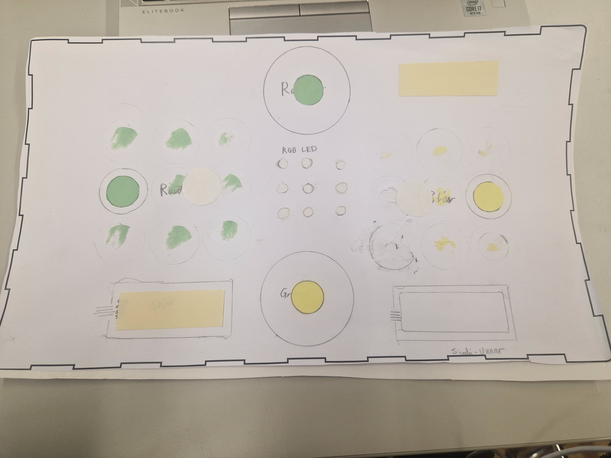

# Super Mylla

### Unnar Fróði og Sindri Snær

Hugmyndinn er mylla sem að endar aldrei í jafntefli með því að hafa timer og hæfni til að hreyfa það sem að þú ert búinn að gera.

Þegar leikurinn byrjar hefur hver spilari 30 sekúndur, klukkan hreyfist bara þegar maður er að gera og ef að tíminn rennur út þá tapar maður.

Til skiptist setur hver leikmaður sína liti og getur síðan hreyft þá til þess að reyna að fá þrjá í röð eða á ská, og þá vinnur hann.

## Annað:

# Reglur

1. 2 Spilarar
1. Hver spilari hefur sinn lit
1. Fyrstur að fá 3 af sínum lit í röð eða á ská vinnur
1. Það verður max 4 rauðir og max 4 bláir
1. Það má færa sinn lit í staðinn fyrir að setja litinn sinn á nýjan reitt
1. Hver leikmaður fær 30 sekóndur samtals til að ákvæða hvað þeir ætla að gera í hverjum leik 

## Hvernig á að spila

1. Byrjið á því að ýta á start takann (græni takkinn)
1. Annar hvor (random) hlið byrjar og tíminn hjá þeim byrjar
1. Ýtu á takka þar sem þú ert nú þegar með lit og á nýjan reitt til að færa litinn þinn

# Myndir

# STL og SVG

4.svg)

.stl)
