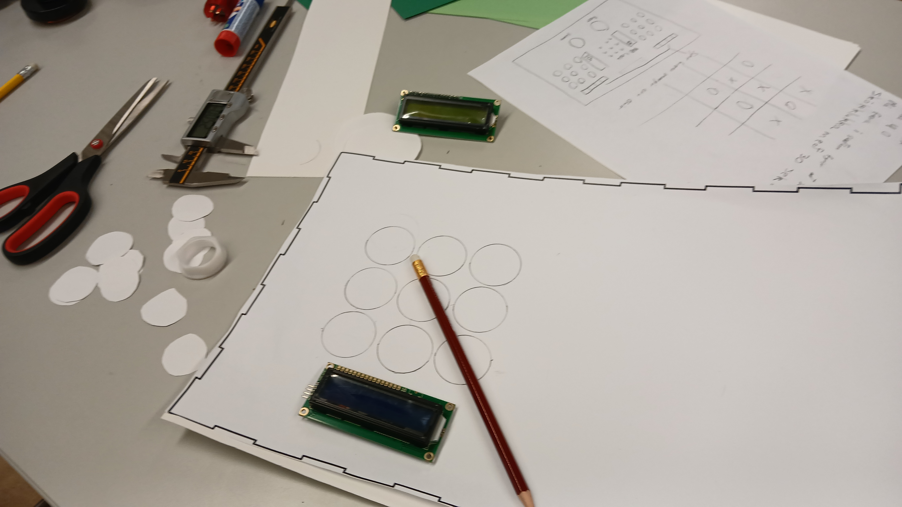
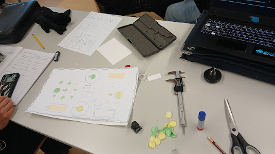

# Super-Mylla

## Reglur

1. 2 Spilarar
1. Hver spilari hefur sinn lit
1. Fyrstur að fá 3 af sínum lit í röð eða á ská vinnur
1. Það verður max 4 rauðir og max 4 bláir
1. Það má færa sinn lit í staðinn fyrir að setja litinn sinn á nýjan reitt
1. Hver leikmaður fær 30 sekóndur samtals til að ákvæða hvað þeir ætla að gera í hverjum leik 

## Hvernig á að spila

1. Byrjið á því að ýta á start takann (græni takkinn)
1. Annar hvor (random) hlið byrjar og tíminn hjá þeim byrjar
1. Ýtu á takka þar sem þú ert nú þegar með lit og á nýjan reitt til að færa litinn þinn

# Dagbók

### 29/01/2026 11:36  
Í dag vorum við hanna spilið okkar, hugmyndavinna.

Við erum byrjaðir að líma inn lifesize spilið okkar á blað. Viðerum búnir að mæla og finna út hvernig útlit spils okkar á að líta út

Við erum búnir að finna og hanna útlit frumgerðinnar. 

### 03/02/2026 11:36
Í dag kláruðum við að hanna spilið okkar og byrjuðum á inkscape

Við kláruðum að líma á blaðið og passa að við erum undir 25 pinna.

### 10/2/2026 9:36
Í dag gerðum við 3D printið sem við þurftum að gera fyrir verkefnið

https://www.tinkercad.com/things/iYjSP6P9Iwf-super-allis/edit?returnTo=https%3A%2F%2Fwww.tinkercad.com%2Fdashboard&sharecode=AnAxkJOx8Rs0iQONwBZLLFXauEL3TW91G2C5AZmT7xA

